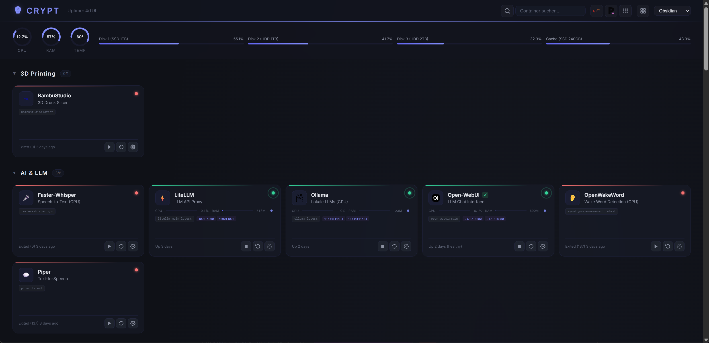
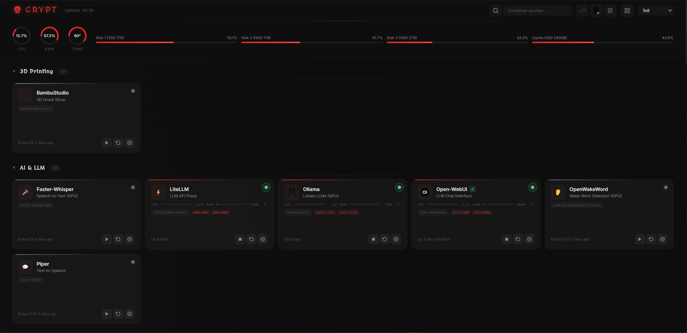
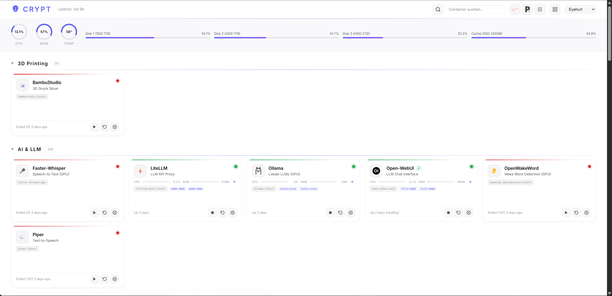
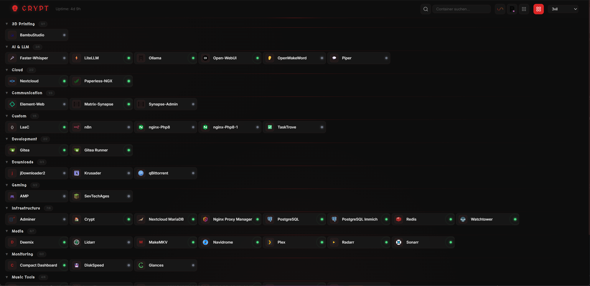
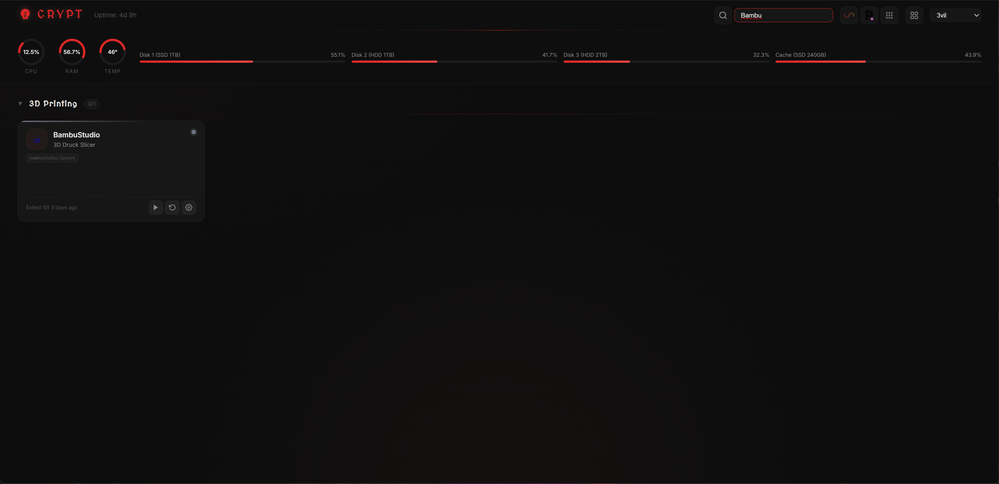
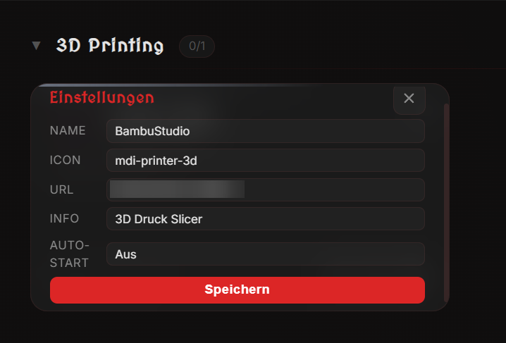

# Crypt Dashboard

A sleek Docker management dashboard with real-time container monitoring, start/stop controls, and a compact mode.


## Features

- **Real-time monitoring** — CPU, RAM, and network stats per container
- **Container controls** — Start, stop, restart directly from the dashboard
- **Compact mode** — Toggle between detailed cards and a minimal icon grid
- **13 themes** — Crypt, Arctic, Ember, Emerald, Neon, Synthwave, and more
- **Auto-discovery** — Reads Docker labels (`homepage.*`) to organize containers into groups
- **Per-container settings** — Override name, icon, URL, and restart policy via the UI
- **NPM integration** — Auto-detects Nginx Proxy Manager URLs (optional)
- **System metrics** — CPU, RAM, temperature, and disk usage overview
- **Search** — Filter containers with Ctrl+K
- **3D tilt effect** — Subtle card hover animations
- **Zero dependencies** — No frontend framework, pure vanilla JS

## Quick Start

```bash
git clone https://github.com/DJ3vil/crypt-dashboard.git
cd crypt-dashboard
docker compose up -d
```

Open **http://localhost:3080**

## Adding Containers

Crypt discovers containers automatically — no config files needed. Just add Docker labels and they appear on the dashboard.

### Step 1: Add Labels to Your Container

Add `homepage.*` labels to your `docker-compose.yml`:

```yaml
services:
  plex:
    image: plexinc/pms-docker
    ports:
      - "32400:32400"
    labels:
      homepage.name: Plex
      homepage.group: Media
      homepage.icon: plex.png
      homepage.href: http://10.10.5.2:32400
      homepage.description: Media Server
```

The container will appear on the dashboard on the next refresh (polling interval is a few seconds).

### Step 2: Customize via the UI (Optional)

Click the **gear icon** on any container card to open the settings panel. You can override:

| Setting | Description |
|---------|-------------|
| **Name** | Display name (overrides `homepage.name`) |
| **Icon** | Icon identifier or URL (overrides `homepage.icon`) |
| **URL** | WebUI link (overrides `homepage.href`) |
| **Description** | Short info text (overrides `homepage.description`) |
| **Restart Policy** | `no`, `always`, `unless-stopped`, or `on-failure` |

UI overrides are saved to `/appdata/settings.json` and persist across restarts.

### Label Reference

| Label | Required | Description | Default |
|-------|----------|-------------|---------|
| `homepage.name` | **Yes** | Display name — container is hidden without this | — |
| `homepage.group` | No | Group name for organizing containers | `Ungrouped` |
| `homepage.icon` | No | Icon (see below) | First letter of name |
| `homepage.href` | No | WebUI URL | No link |
| `homepage.description` | No | Short description | Container name |

### Icons

Icons can be specified in three ways:

| Format | Example | Source |
|--------|---------|--------|
| Filename | `plex.png`, `sonarr`, `radarr` | [dashboard-icons](https://github.com/homarr-labs/dashboard-icons) |
| MDI prefix | `mdi-music-note`, `mdi-movie` | Material Design Icons |
| Full URL | `http://example.com/icon.svg` | Any URL |

Browse available icons at [dashboard-icons](https://github.com/homarr-labs/dashboard-icons). Use the filename with or without extension.

### Groups

Containers are organized into collapsible groups based on the `homepage.group` label. Groups are sorted alphabetically, and each group shows a running/total count (e.g., `3/5`). Click a group header to collapse or expand it — the state persists in your browser.

### Hiding Containers

A container only appears on the dashboard if it has the `homepage.name` label. To hide a container, simply don't add that label — or remove it.

## Configuration

### Environment Variables

| Variable | Description | Default |
|----------|-------------|---------|
| `TZ` | Timezone | `UTC` |
| `PORT` | Internal port | `3000` |
| `SERVER_IP` | Server IP for generating URLs | auto-detect |
| `HOST_PROC` | Mounted `/proc` path for CPU/RAM stats | — |
| `HOST_SYS` | Mounted `/sys` path for disk stats | — |

### Optional Volumes

| Volume | Purpose |
|--------|---------|
| `/var/run/docker.sock` | **Required** — Docker API access |
| `/appdata` | Persist per-container settings |
| `/data/npm.sqlite` | Nginx Proxy Manager DB for auto-detecting proxy URLs |
| `/host/proc`, `/host/sys` | System metrics (CPU, RAM, temp) |
| `/mnt/diskN` | Disk usage monitoring |

### Themes

Switch themes via the dropdown in the header. Available: `crypt`, `3vil`, `arctic`, `ember`, `emerald`, `eyehurt`, `gold`, `midnight`, `neon`, `obsidian`, `phantom`, `rose`, `synthwave`.

## Compact Mode

Click the grid icon in the header to toggle compact mode:
- Icons with names and status dots
- Click to open WebUI
- Right-click for start/stop/restart context menu
- Setting persists across reloads

## Screenshots

### Default Theme (Crypt)


### 3vil Theme


### Light Theme


### Compact Mode


### Search (Ctrl+K)


### Container Settings


## License

MIT
